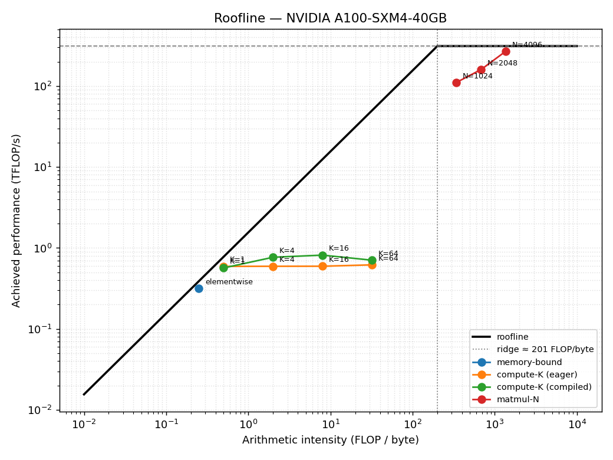
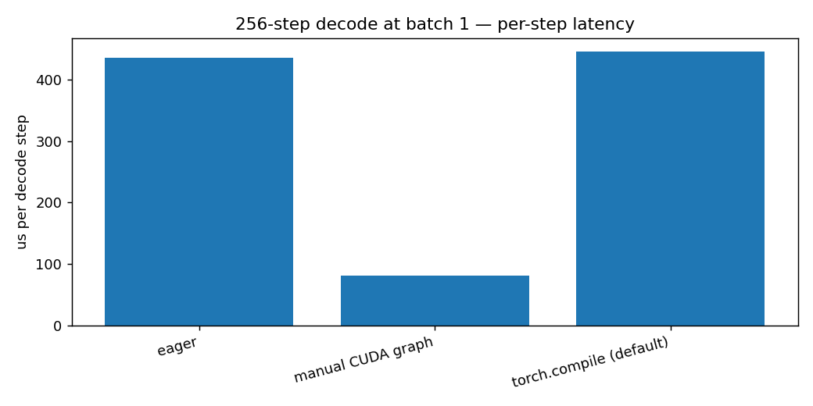

# GPU & CUDA Inference Optimization

> Three hands-on notebooks that profile real GPU kernels and make a transformer
> decode loop dramatically faster: roofline analysis, KV-cache optimization, and
> kernel-launch elimination with `torch.compile` and CUDA graphs.


## Demo

| Roofline (notebook 01, A100) | Decode-step latency (notebook 03, batch 1) |
|---|---|
|  |  |

Optimized greedy decode runs **4.21× faster** than the naive baseline on an A100
(fp32 KV cache, bit-exact tokens), and a hand-rolled CUDA graph replays a batch-1
decode step at **5.38× over eager**.

## What This Project Demonstrates

- **Roofline analysis**: placing real kernels on the memory-bound/compute-bound
  roofline of a specific GPU from first-principles measurements.
- **Correct GPU timing**: CUDA-event timing with warmup, accounting for
  asynchronous execution (no `time.time()` traps).
- **Autoregressive decode optimization**: KV cache, removing per-step host
  syncs, and a measured bf16 ablation, for a **≥4×** end-to-end speedup with
  bit-exact greedy tokens.
- **Profiling**: reading `torch.profiler` Chrome traces in Perfetto to find
  launch gaps, tiny-kernel runs, and host syncs.
- **`torch.compile` & CUDA graphs**: eliminating graph breaks (`fullgraph=True`)
  and capturing/replaying a decode step by hand to kill launch overhead.

## Quick Start

```bash
git clone <repo-url>
cd gpu-cuda-inference-optimization
pip install -r requirements.txt

# Local (macOS / no GPU): smoke-test the self-checks only.
jupyter lab

# Real run (numbers that count): open each notebook on a GPU.
#   Google Colab ▸ Runtime ▸ Change runtime type ▸ GPU ▸ Run all.
#   Colab preinstalls torch; you may only need:  pip install -q "transformers>=4.42,<5"
```

> **GPU required for real results.** The notebooks run on CPU as a correctness
> smoke test but print warnings and trim work: all reported numbers must come
> from a GPU (H100 / L40S / T4).

## Notebooks

| Notebook | Topic | Implements | Run |
|----------|-------|-----------|-----|
| [`01_roofline.ipynb`](01_roofline.ipynb) | Roofline & arithmetic intensity | CUDA-event timer, roofline metrics, memory-/compute-bound workloads | [](https://colab.research.google.com/github/MGhanayim/gpu-cuda-inference-optimization/blob/main/01_roofline.ipynb) |
| [`02_decode_optimization.ipynb`](02_decode_optimization.ipynb) | Profile & optimize a decode loop | profiler wrapper, KV-cache greedy decode, timed optimized run | [](https://colab.research.google.com/github/MGhanayim/gpu-cuda-inference-optimization/blob/main/02_decode_optimization.ipynb) |
| [`03_compile_cuda_graphs.ipynb`](03_compile_cuda_graphs.ipynb) | `torch.compile` & CUDA graphs | launch-overhead sweep, break-free compiled step, manual CUDA graph | [](https://colab.research.google.com/github/MGhanayim/gpu-cuda-inference-optimization/blob/main/03_compile_cuda_graphs.ipynb) |

Each notebook: a fixed harness, functions implemented against it, self-checks
that must pass, and a short analysis. They build on each other and read in order.

## Architecture

A single measure → analyze → optimize pipeline runs through all three notebooks:
build a workload, execute it (eager / compiled / graphed), time or profile it,
derive metrics, and write the result. Full layered breakdown, call graphs, and
diagrams are in **[ARCHITECTURE.md](ARCHITECTURE.md)**.

## Tech Stack

- **PyTorch ≥ 2.4**: CUDA events, `torch.compile`, `CUDAGraph`, BF16 tensor cores.
- **transformers ≥ 4.42**: a tiny synthetic Llama + KV-cache API (notebook 02).
- **matplotlib / numpy**: roofline and latency plots.
- **No external inference engines** (vLLM / TensorRT-LLM / SGLang) by design:
  every optimization is built from PyTorch primitives.

## Example Results

Measured on a paid Colab **A100-SXM4-40GB** (absolute numbers vary by GPU; the
relative results are the point):

- **Notebook 01 (roofline):** the elementwise op sits on the bandwidth roof (AI = 0.25,
  ~1257 GB/s, ~81% of the A100's HBM bandwidth), while the N x N x N matmul climbs
  the ridge toward the compute ceiling (N=4096 reaches ~270 TFLOP/s, ~87% of the
  A100's BF16 peak).
- **Notebook 02 (decode):** V0 baseline 1723 ms -> fp32 KV cache 410 ms = **4.21×**
  (excellent tier), greedy tokens bit-exact. bf16 measured *slower* (432 ms) and
  was dropped: this batch-1 toy decode is launch-bound, not bandwidth-bound, so
  halving the bytes buys nothing.
- **Notebook 03 (launch overhead):** per-launch cost ~11 µs; a hand-rolled CUDA graph
  replays the decode step at **5.38×** over eager (435.6 -> 80.9 µs/step) at
  batch 1. `torch.compile` default came in at 0.98× (fusion does not cut launch
  overhead), and reduce-overhead errored on the static-buffer constraint.

## Project Structure

```
.
├── 01_roofline.ipynb             # roofline & arithmetic intensity
├── 02_decode_optimization.ipynb  # profile + optimize a decode loop
├── 03_compile_cuda_graphs.ipynb  # torch.compile & CUDA graphs
├── results/                      # plots, JSON, traces (git-ignored except demo plots)
├── SPEC.md   ARCHITECTURE.md   CLAUDE.md   # project docs
└── requirements.txt
```

## Key Concepts

- **Arithmetic intensity (AI):** FLOPs performed per byte moved to and from HBM
  (unit: FLOP/byte). It is the x-axis of the roofline and a property of the
  *workload*, not the hardware. Low AI (few ops per byte loaded) means
  memory-bound; high AI means compute-bound. An elementwise op is about
  0.25 FLOP/byte; an N×N×N matmul is about (2/3)·N/dbytes, which grows with N.
- **Roofline:** a log-log plot of achieved performance (TFLOP/s) against
  arithmetic intensity. Two ceilings bound it: a sloped bandwidth limit
  (peak_BW × AI) on the left and a flat compute limit (peak FLOP/s) on the right.
  The ridge point where they meet (peak FLOP/s ÷ peak BW) separates memory-bound
  from compute-bound.
- **Memory-bound vs compute-bound:** memory-bound work is limited by how fast
  bytes move to and from HBM (it sits under the sloped ceiling, left of the
  ridge); compute-bound work is limited by how fast the cores do math (under the
  flat ceiling, right of the ridge).
- **Kernel:** a single function that runs on the GPU, executed in parallel by
  many threads. Each PyTorch op (`sin`, `add`, `matmul`) launches one or more
  kernels, and every launch costs the CPU a fixed few microseconds regardless of
  the work (the launch overhead measured in notebook 03).
- **HBM (High Bandwidth Memory):** the GPU's main memory (its VRAM, for example
  40 GB on an A100-40GB) with very high bandwidth (about 1.5 TB/s). Reading
  inputs from HBM and writing results back (an "HBM round-trip") is what limits
  memory-bound ops; the roofline's sloped ceiling *is* the HBM bandwidth.
- **Eager:** PyTorch's default execution mode. Each op runs immediately as its
  own kernel launch with its own HBM round-trip. Simple and easy to debug, but a
  chain of K ops pays K launches and K round-trips.
- **Compiled (`torch.compile`):** traces the function into a graph and generates
  *fused* kernels. For an op chain it fuses many ops into one kernel (read from
  HBM once, compute in registers, write once), cutting launches and HBM
  round-trips. It costs a one-time compile (so timing needs warmup) and can
  "graph break" on some Python constructs (the subject of notebook 03).

## Docs

- **[SPEC.md](SPEC.md)**: requirements as acceptance criteria + verification checklist.
- **[ARCHITECTURE.md](ARCHITECTURE.md)**: architecture, dependency rules, diagrams, walkthroughs.
- **[CLAUDE.md](CLAUDE.md)**: working rules for AI-assisted sessions in this repo.

## License

MIT
